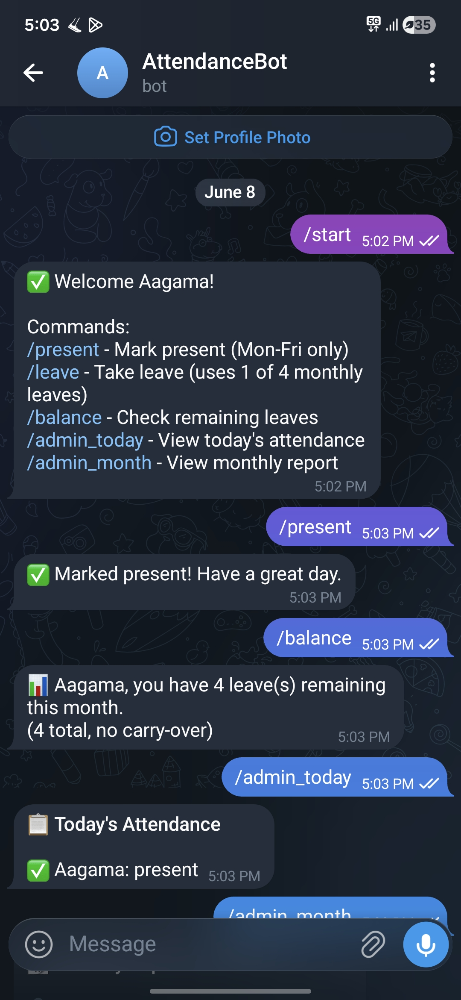
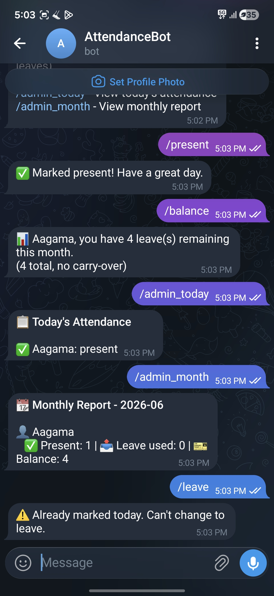

# 📊 Team Attendance Bot (v1 — MVP)

> **A single-file Telegram bot that replaces daily WhatsApp attendance polls for one small team.**
> This is the original proof-of-concept. The production-ready, multi-tenant rewrite lives here → **[Team_Attendance_Bot_v2](https://github.com/aagamaar/Team_Attendance_Bot_v2)**

[](https://www.python.org/)
[](https://render.com)
[](https://github.com/aagamaar/Team_Attendance_Bot_v2)

---

## The Problem

Small teams track attendance through daily WhatsApp polls. Admins count responses by hand, employees get notification fatigue, and leave balances live in a separate spreadsheet that's always slightly out of date.

## The MVP Hypothesis

Before building anything elaborate, this version tested one idea: **if marking attendance takes 2 seconds inside an app people already have (Telegram), will a team actually use it?**

So v1 is deliberately minimal — one Python file, one SQLite database, one team. It proved the workflow, and the lessons learned here directly shaped the architecture of [v2](https://github.com/aagamaar/Team_Attendance_Bot_v2).

---

## ✨ What It Does

- ⚡ Mark attendance with a single `/present` command (Mon–Fri only)
- 🏖️ Weekends auto-detected — no marking needed, no leave deducted
- 📊 Leave tracking: 4 leaves per employee per month, no carry-over
- 🚫 Double-marking blocked at the database level (`UNIQUE(user_id, date)`)
- 📋 Daily team view and monthly summary for admins
- 📥 One-command CSV export, ready to drop into Google Sheets

## 📸 Screenshots

| User View | Admin View |
|-----------|------------|
|  |  |

## 🎯 Commands

| Command | What it does |
|---|---|
| `/start` | Register yourself & see the command list |
| `/present` | Mark present for today (weekdays only) |
| `/leave` | Take a leave (uses 1 of 4 monthly leaves) |
| `/balance` | Check your remaining leaves |
| `/admin_today` | Today's attendance for the whole team |
| `/admin_month` | Monthly report: present days, leaves used, balances |
| `/export` | Download the monthly report as a CSV file |

---

## 🛠️ Tech Stack

| Layer | Choice | Why |
|---|---|---|
| Language | Python | fastest path to a working bot |
| Bot framework | python-telegram-bot | async command handlers, long polling |
| Database | SQLite | zero-config, one file, perfect for one team |
| Keep-alive | Flask health endpoint (background thread) | free Render services sleep without inbound pings |
| Hosting | Render | deploy from GitHub in minutes |

```
Team_Attendance_Bot/
├── bot.py             # Everything: handlers, schema, Flask health server (~230 lines)
└── requirements.txt   # Dependencies
```

**Small design decisions that carried into v2:**
- **Self-initializing schema** — `CREATE TABLE IF NOT EXISTS` on startup, so deploys need zero manual setup
- **Database-level integrity** — the unique constraint on `(user_id, date)` makes double-marking impossible, not just discouraged
- **Health endpoint pattern** — a tiny Flask server keeps the polling bot alive on free hosting

---

## 🚦 Run It Locally

```bash
git clone https://github.com/aagamaar/Team_Attendance_Bot.git
cd Team_Attendance_Bot
pip install -r requirements.txt

# Get a token from @BotFather on Telegram, then:
export TELEGRAM_TOKEN="your-token-here"     # Windows: set TELEGRAM_TOKEN=your-token-here
python bot.py
```

Open your bot on Telegram → `/start` → `/present`. Done.

## ☁️ Deploy on Render (free)

1. Fork/push this repo to GitHub
2. [render.com](https://render.com) → **New → Web Service** → connect the repo
3. Build command: `pip install -r requirements.txt` · Start command: `python bot.py`
4. Add environment variable `TELEGRAM_TOKEN`
5. Deploy — the table schema creates itself on first boot

> ⚠️ Free Render services sleep after 15 minutes of inactivity. Use a free [cron-job.org](https://cron-job.org) job to ping the service URL every 10 minutes so the bot keeps listening.

---

## 🧪 Known Limitations (a.k.a. why v2 exists)

Being an MVP, v1 cuts corners on purpose. Each gap below became a requirement for v2:

| Limitation in v1 | How v2 solves it |
|---|---|
| Single team only — everyone shares one database | Multi-tenant: unlimited organizations, isolated by `org_id`, joined via secure 6-char codes |
| Admin commands aren't permission-guarded | Role system with admin-only guards, `/make_admin`, `/remove_admin` |
| Leave balance resets only if someone runs a command on the 1st of the month | Lazy monthly reset tracked via `last_reset_month` — works no matter when users interact |
| Dates use the server's timezone (wrong on UTC hosts) | All dates computed in IST (`Asia/Kolkata`) |
| No abuse protection | Per-user rate limiting (20 commands/minute) |
| One monolithic file | Modular package: separate command modules, database layer, utils |

👉 **Try the live v2 bot:** [t.me/Att_end_ance_bot](https://t.me/Att_end_ance_bot) · **Code:** [Team_Attendance_Bot_v2](https://github.com/aagamaar/Team_Attendance_Bot_v2)

---

## 👩‍💻 Author

**Aagama A R** — [GitHub](https://github.com/aagamaar) · [LinkedIn](https://linkedin.com/in/YOUR_LINKEDIN)

Built with [python-telegram-bot](https://github.com/python-telegram-bot/python-telegram-bot). Hosted on [Render](https://render.com).

⭐ **Star this repo if you found it useful!**